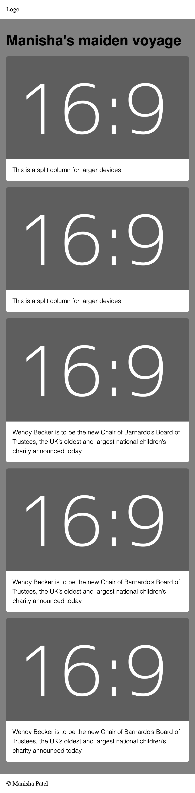
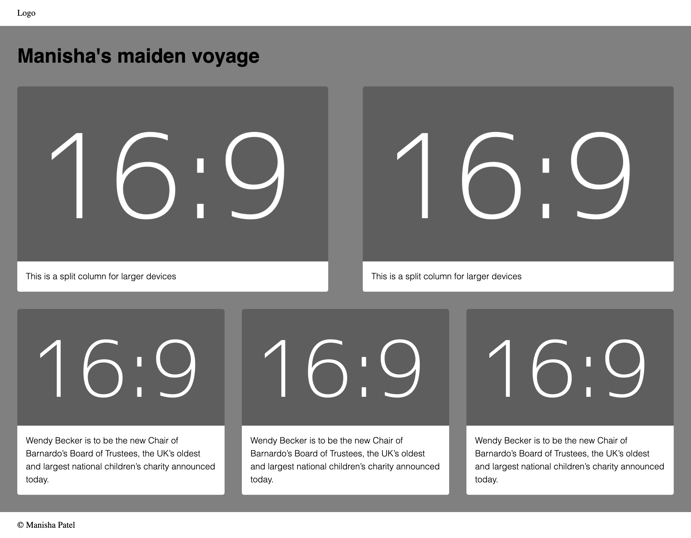

# Building a responsive, mobile first layout

## What to build

1. A webpage layout that looks like the below for smaller viewports:

<a href="./readme-assets/large-viewport.png">Full image here</a>

2. That also looks like the below on larger viewports:

<a href="./readme-assets/large-viewport.png">Full image here</a>

### Concepts to learn and understand during this process:

_Please note_ you do not have to follow any of these tutorials to the letter, just so you have a reference to something that will help you build what you need. Remember we have also done this together before you went to Makers, you have that project to refer to.

- HTML (https://www.tutorialrepublic.com/html-tutorial/)
- Semantic Markup (https://developer.mozilla.org/en-US/docs/Learn/Accessibility/HTML)
  - Calling something what it is.
- Responsive Layout ()
  - CSS: https://www.tutorialrepublic.com/css-tutorial/
  - Flexbox: https://css-tricks.com/snippets/css/a-guide-to-flexbox/
  - Media Queries: https://www.tutorialrepublic.com/css-tutorial/css3-media-queries.php
- Images: feel free to use this https://dummyimage.com/921x518/5e5e5e/ffffff&text=16:9

### Outcomes

Use a variety of different HTML elements and different CSS approaches if you deem it necessary. I'll be doing this too so we can compare and see what you did and why you did it that afterwards.

1. Start with a simple layout to achieve the above.
2. Test for accessibility errors and let me know what you find, if you can fix them, go ahead.
3. As a further step we can add a responsive nav. This will require some JS.

Do the best you can, please ask if you have any questions or need more resources.
